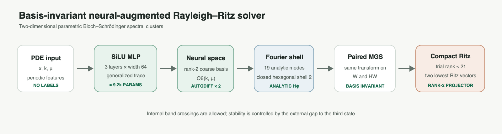
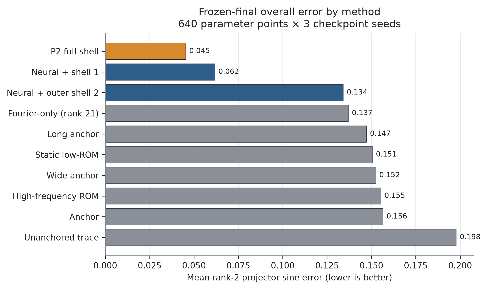
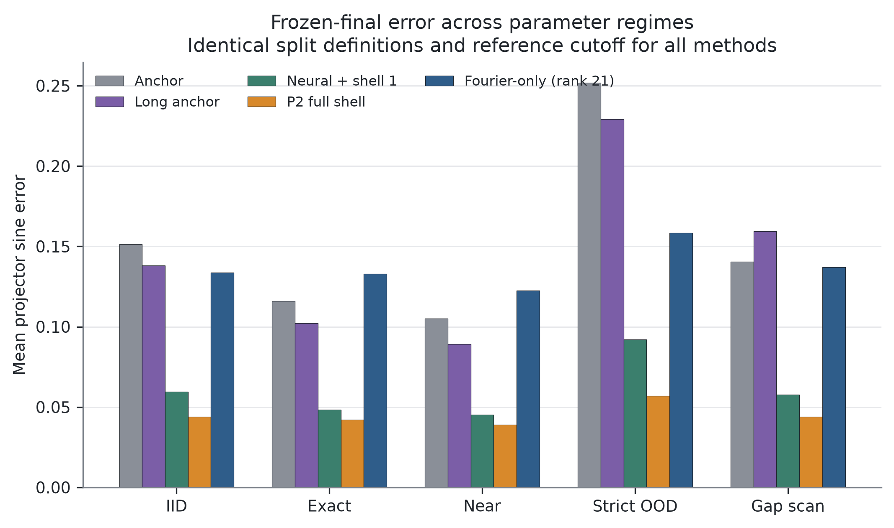
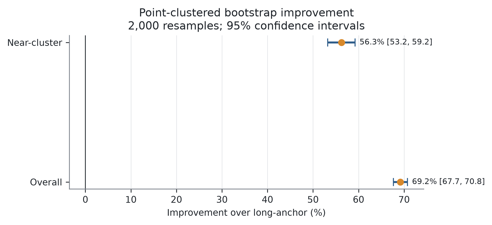
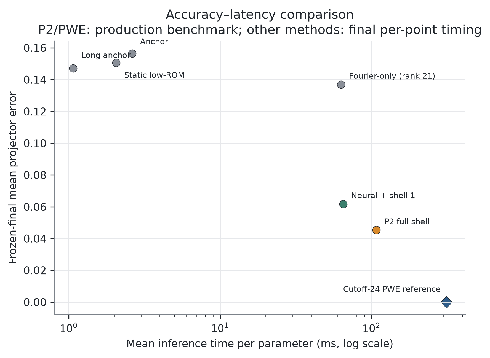

# 面向本征值交叉的参数化 Bloch 谱簇基底不变神经增强 Rayleigh–Ritz 求解器

> **已废止——禁止投稿。** 2026-08-27 外部复审发现本版本 reciprocal shell 与 kinetic
> metric 的符号约定不一致。P2/Q3 数值只作为不可修改的历史证据保留；当前方法已经进入
> V3 对称性修正 SR-SC-NARR 协议，必须等新的 CUDA confirmation 后重写本文。
>
> 中文论文稿 v0.3，2026-08-27。所有数值均来自已封存实验；NMPDE 方向的可编辑英文
> DOCX 与 PDF 预览已经完成。作者姓名、单位、ORCID、CRediT、资助和投稿系统元数据仍需
> 作者本人填写；公式级期刊基线适配与作者官方实现严格区分。

## 摘要

参数化 Bloch 本征问题需要重复求解 PDE 实例，而内部能带交叉会使逐条编号的本征
函数发生标签交换。本文面向二维 Bloch–Schrödinger 方程的最低 rank-2 谱簇，提出基底
不变的神经增强 Rayleigh–Ritz 求解器。SiLU MLP 通过无标签 generalized-trace 目标预测
粗子空间；推理时加入完整二阶六角 Fourier 壳层，仅对两个神经列使用自动微分，并解析
计算19个 Fourier 列的 Hamiltonian。640点 frozen final 中，本文方法的总体 projector
error 为0.04532，long-anchor 为0.14719，改善69.19%，95% CI 为
[67.66%,70.75%]。在独立160点 supplement 中，P2 为0.04728，
Wang–Xie trace 适配为0.13114，改善63.78%，95% CI 为[59.58%,67.88%]，且
6/6个 family×seed 配对获胜。结果表明，该混合神经数值求解器能够稳定处理内部交叉，
并形成可复现的精度—成本折中。

**关键词：** 神经偏微分方程求解；参数化本征问题；Bloch–Schrödinger 方程；谱簇；
Rayleigh–Ritz；基底不变性；科学机器学习

## 1 引言

Physics-informed neural networks（PINNs）把微分方程、边界条件或变分原理直接写入
训练目标，使神经网络能够在有限标签甚至无标签条件下近似 PDE 解 [1]。参数化问题还
提供了一个额外价值：同一网络可以学习参数到解的映射，使一次训练服务于许多后续查询。
Conditional PINN 已在参数化本征问题中验证这一思路 [2]。然而，本征问题与普通初边值
问题不同。网络不仅需要避免零解，还必须区分多个本征态，并处理重数、内部交叉和任意
相位或基变换。

二维 honeycomb 周期势的 Bloch–Schrödinger 算子在 Brillouin 区顶点可产生 Dirac 型
锥形交叉 [11]。在交叉处，“第一条”和“第二条”能带的单独标签不再构成连续目标，具体
本征向量还可在简并子空间内任意旋转。直接回归有序本征函数或最小化逐态残差，容易把
表示选择误认为物理解。与此相对，只要最低两态与第三态之间仍保留外部谱隙，整个
rank-2 eigenspace 或 spectral projector 仍是良定对象 [7]。

已有研究提供了本文所需的多个组成部分。Wang 和 Xie 使用 tensor neural networks 与
trace 目标同时计算多个本征对 [3]；Rowan 等采用 Rayleigh quotient 和 Gram–Schmidt
求解工程本征问题 [4]；Dai 等进一步构造神经试验子空间并在其中进行 Galerkin 投影
[5]。参数化神经本征分析还出现在 Shape Space Spectra [6]、监督式 Grassmann subspace
regression [8] 以及周期量子系统的 equation-driven 网络 [13] 中。传统 reduced-basis
研究也已用于 Bloch band structure [9] 和含参数相关重数的椭圆本征问题 [10]。因此，
本文不把 Ky Fan、trace、Fourier、Galerkin 或 Rayleigh–Ritz 作为单独的原创点。

本文关注一个更具体的问题：如何在不使用本征函数监督标签、不为内部交叉能带强行编号的
前提下，利用一个轻量参数网络生成可摊销的神经粗子空间，并通过固定、紧凑、可解析装配
的 Fourier 壳层提高其精度与安全性。主要贡献如下。

**贡献 1——交叉感知目标。** 将二维参数化 Bloch–Schrödinger 问题表述为 rank-2 谱投影学习，训练、推理与评价均
   对目标簇内的复酉基变换不敏感。
**贡献 2——神经—解析试验空间。** 构造由无标签神经粗子空间和完整二阶六角 Fourier 壳层组成的紧凑试验空间。相同秩的
   Fourier-only 控制证明，性能增益不能由固定字典单独解释。
**贡献 3——配对快速装配。** 对 neural/Fourier 两类列采用混合 Hamiltonian 装配：两个神经列保留自动微分，19 个
   Fourier 列解析计算，并对 `(W, HW)` 同步施加正交变换。
**贡献 4——冻结证据协议。** 通过独立 pilot、一次性 frozen final，以及一个160点期刊基线 supplement，使用两个
   势族、3 seeds、点聚类 bootstrap 与证据哈希审计检验精度、稳定性和效率。

本文当前的可证主张限于上述组合机制及冻结 benchmark。独立 supplement 已完成
Wang–Xie/Dai 机制的统一 Bloch 公式级适配；这些结果不能描述成作者官方代码复现。

## 2 相关工作

### 2.1 神经 PDE 与神经本征求解

经典 PINN 以点态 PDE residual、初边界条件和可选数据项训练网络 [1]。在本征问题中，
本征值未知、零函数天然满足齐次方程、多个本征函数还需归一化与正交约束。Jin 等提出
无监督量子本征 PINN，并使用归一化和正交损失发现多个量子态 [14]。Kovacs 等让一个条件
网络覆盖一类参数化本征问题 [2]。这些工作证明无标签神经本征求解是可行的，但逐态表示
在本征值交叉处仍可能发生标签不连续。

Wang 和 Xie 通过 trace 型目标和 tensor neural networks 同时求解多个本征对 [3]，说明
子空间或多本征对的联合优化可以避免串行 deflation 的部分困难。Rowan 等展示了
Rayleigh quotient 与 Gram–Schmidt 在连续工程本征问题中的稳定性 [4]。这些研究是本文
神经粗子空间与变分训练的直接基础，但没有针对一张参数网络在 Bloch 内部交叉处预测
固定秩低能 projector 的完整设定。

### 2.2 神经子空间、Galerkin 与参数化 eigenspace

Dai、Fan 和 Sheng 先由神经网络生成正交基，再将本征问题投影到神经子空间中求解 [5]。
该方法与本文最接近，因此必须作为期刊级最近邻对照。区别在于，本文的目标是跨 Bloch
参数的内部交叉 rank-2 谱簇，试验空间显式结合物理 anchor、神经粗基与闭合六角壳层，
并使用解析 Fourier Hamiltonian 与 paired orthogonalization。该差异是否足以支持更强
主张，已通过独立公式级 Bloch 适配进行实验检查；作者官方实现级差异仍需在局限中承认。

Chang 等的 Shape Space Spectra 使用单一神经场处理连续形状族，在重数点动态重排具体
本征函数 [6]。本文不动态指定簇内模态身份，而直接预测和评价 rank-2 projector。
Fanaskov 等把参数到子空间的映射表述为 Grassmann regression，并使用监督子空间标签
[8]；本文训练阶段不读取 PWE projector 标签。Grubišić 等证明了外部隔离的参数化
eigenspace 可在内部交叉附近保持良好参数依赖 [7]，为选择谱簇而非逐态标签提供了理论
依据。

### 2.3 Bloch reduced basis 与周期量子网络

Pau 将 reduced-basis 方法用于重复 band-structure 计算 [9]。Horger 等针对参数化椭圆
本征问题同时近似多个本征空间，并强调参数相关重数和误差估计 [10]。Hsu 等使用
equation-driven 神经网络求解二维周期量子系统的能带与波函数 [13]。这些工作说明 Bloch
问题、参数摊销、神经 PDE 和 reduced basis 之间具有直接联系，也压缩了本文的创新空间。
Haasdonk 等构建了带后验误差控制的层次化 FOM–ROM–ML 链 [12]，进一步说明混合神经
数值求解器应同时报告精度、成本和可靠性，而不能只比较网络 forward 时间。
本文的贡献必须落在“内部交叉谱簇 + 无标签神经粗子空间 + 闭合解析壳层 + 快速配对装配
+ 冻结验证”的整体，而不是把二维 honeycomb 或 Fourier 展开本身称为新方法。

## 3 问题定义

### 3.1 二维 Bloch–Schrödinger 本征 PDE

在周期胞元 \(\Omega=[0,2\pi)^2\) 上考虑

\[
\mathcal H_{\mathbf k,\mu}u_j=
\left[\frac12(-i\nabla+\mathbf k)^T G(-i\nabla+\mathbf k)
+V_\mu(\mathbf x)\right]u_j
=E_j u_j,
\]

其中 \(u_j\) 及其一阶导数满足二维周期边界条件。代码采用的 reciprocal metric 对应
动能

\[
T(\mathbf m,\mathbf k)=\frac12[(m_1+k_1)^2+(m_2+k_2)^2
+(m_1+k_1)(m_2+k_2)].
\]

harmonic honeycomb 势写为

\[
V_{a,\delta}(x,y)=a[\cos x+\cos y+\cos(x-y)]
+\delta[\sin x-\sin y-\sin(x-y)],
\]

其中 \(a\in[0.2,0.8]\)、\(\delta\in[-0.08,0.08]\)。Gaussian honeycomb 使用两个
周期高斯子晶格，参数为振幅 \(a\in[1,4]\)、宽度 \(\sigma\in[0.18,0.35]\) 和不平衡
量 \(\delta\in[-0.08,0.08]\)。训练区间的 Bloch 波矢为
\(k_x,k_y\in[0.28,0.38]\)。

### 3.2 谱簇目标与指标

令 \(U_2(\mathbf k,\mu)\) 表示最低两个本征态张成的子空间，\(P_2\) 为其正交投影。
内部 gap \(E_2-E_1\) 可以为零，而外部 gap \(E_3-E_2\) 需保持正值。预测基
\(Q\in\mathbb C^{N\times2}\) 与参考基 \(Q_\star\) 的误差定义为所有主角正弦的均方根，

\[
e_{\mathrm{proj}}=
\sqrt{\frac{2-\lVert Q^*Q_\star\rVert_F^2}{2}},
\]

它等价于归一化的 rank-2 projector Frobenius 偏差。该指标不依赖 \(Q\) 的列顺序、
相位或簇内酉旋转。

参考解由 float64 plane-wave expansion（PWE）生成，cutoff 为 24，保留 rank-3 用于检查
外部谱隙，并在 33×33 周期网格上评价参考基。PWE 仅用于评价和审计，不作为网络训练
标签。

## 4 方法

### 4.1 无标签神经粗子空间

网络接收周期特征

\[
[\sin x,\cos x,\sin y,\cos y,\mathbf k,\mu],
\]

经过 3 个宽度为 64 的 SiLU 隐藏层，输出两个复值函数的实部和虚部。harmonic 与
Gaussian 版本分别有 9,156 和 9,220 个可训练参数。K 点附近的两个低能平面波组合构成
固定物理 anchor，网络学习其加性修正。训练使用 Adam，学习率 \(10^{-3}\)，每批 4 个
参数实例、每实例 256 个平移周期网格点。正式 long-anchor checkpoint 训练 665 步，
seeds 为 42、137 和 251。

令原始神经试探矩阵为 \(Z_\theta\)，其 Gram 和 Hamiltonian 矩阵分别为

\[
B_\theta=Z_\theta^*Z_\theta,\qquad
A_\theta=Z_\theta^*\mathcal H Z_\theta.
\]

网络最小化 generalized-trace/Ky Fan 型目标

\[
\mathcal L_{\mathrm{trace}}=\operatorname{Tr}(B_\theta^{-1}A_\theta).
\]

训练不使用 reference eigenvector、projector 或能带标签。评价前以周期胞元等权内积进行
复 modified Gram–Schmidt，得到 rank-2 神经粗基 \(Q_\theta\)。

### 4.2 完整二阶六角 Fourier 扩充

设

\[
\mathcal M_2=\{(m_1,m_2)\in\mathbb Z^2:
\max(|m_1|,|m_2|,|m_1-m_2|)\le 2\},
\]

该闭合壳层包含 19 个 reciprocal modes。对应平面波为
\(\phi_m(\mathbf x)=e^{i m\cdot x}\)。P2 构造

\[
W=[Q_\theta,\{\phi_m:m\in\mathcal M_2\}].
\]

每个解析列先投影到当前已接受列的正交补。投影后范数低于 \(10^{-5}\) 的依赖方向被
拒绝。完整设置通常形成 21 维紧凑试验空间。由于追加和评价都以子空间投影完成，
\(Q_\theta\) 在 rank-2 内的任意酉旋转不会改变最终试验空间。

### 4.3 解析 Hamiltonian 与配对正交化

神经列的 \(\mathcal H Q_\theta\) 由 PyTorch 自动微分计算。对 Fourier 列，

\[
\mathcal H\phi_m=
\left[T(\mathbf m,\mathbf k)+V_\mu(\mathbf x)\right]\phi_m,
\]

因此无需为 19 个解析列建立二阶自动微分图。正交化过程中，对试验列 \(w\) 施加的每个
复线性变换同时作用于 \(Hw\)。这样得到成对矩阵 \((\widehat W,H\widehat W)\)，避免在
正交化后重新求导，并保持算子线性关系。

### 4.4 小型 Rayleigh–Ritz 提取

在正交试验空间上组装

\[
A_W=\widehat W^*H\widehat W.
\]

求解该约 21×21 的 Hermitian 本征问题，取最低两个 Ritz 向量并映射回函数网格，得到
最终 rank-2 基。P2 不引入新学习参数，也不访问 reference projector。方法流程可概括为

\[
(\mathbf x,\mathbf k,\mu)
\xrightarrow{\text{label-free SiLU MLP}}Q_\theta
\xrightarrow{+\mathcal M_2}\widehat W
\xrightarrow{\text{paired }(W,HW)}A_W
\xrightarrow{\text{Ritz}}\widehat U_2.
\]

**图 1.** P2 基底不变神经增强 Rayleigh–Ritz 流程。

### 4.5 外部谱隙稳定性

令 \(U\) 为最低 rank-2 真实不变子空间，\(Q\) 为正交 Ritz 基，
\(M=Q^*HQ\)，块残差为 \(R=HQ-QM\)。若近似 Ritz 谱与目标簇外真实谱的分离量

\[
\delta=\operatorname{dist}(\sigma(M),\sigma(H|_{U^\perp}))>0,
\]

则 Hermitian 不变子空间扰动界 [15] 给出

\[
e_{\mathrm{proj}}
\le\frac{\lVert R\rVert_F}{\sqrt2\,\delta}.
\]

该界只要求最低两态与第三态保持外部隔离，不要求 \(\lambda_2-\lambda_1>0\)，因此允许
目标簇内部发生 Dirac 交叉。代码报告的 residual RMS 是归一化量，应用该界时必须恢复
离散内积下的 Frobenius 范数。完整命题与证明思路见 `THEORY_AND_COST.zh-CN.md`。

### 4.6 复杂度与成本摊销

对 \(N\) 个网格点、\(M=19\) 个解析模式和 \(r\le21\) 的试验空间，在线复杂度包括两个
神经列的 Hamiltonian 自动微分、\(O(NM)\) 解析 Fourier 作用、\(O(Nr^2)\) 配对正交化和
\(O(r^3)\) 小型 Ritz solve。33×33 网格上，MLP 线性层前向约为19.5M FLOPs。二阶自动
微分的端到端 FLOPs 依赖后端，因此本文报告 wall time，不虚构总 FLOPs。根据归档训练
时间和两组 P2 latency，当前系统级 break-even 约为206–354次重复参数查询。

## 5 实验设计

### 5.1 开发与冻结纪律

P5 低频 ROM 因不敌等成本 long-anchor 且在 gap-scan 回退而判定 STOP。P0 证明失效风险
可检测，但 P1 routing 无法突破两个端点子空间的精度上限，也判定 STOP。P2 早期
outer-shell probe 在 near 区域有效，却未通过 gap 和效率门槛。只有 full-shell 在全新
96 点独立 pilot、两个势族和 3 seeds 上通过全部预注册门槛后，才允许一次性打开 640 点
frozen final。final 运行后永久关闭。

### 5.2 数据划分与基线

Frozen final 含 640 个参数点：IID 192、exact-cluster 64、near-cluster 128、strict-OOD
128、gap-scan 128。两个势族各 320 点。每个点用 3 个 checkpoint seeds 评价 10 种方法，
共 19,200 行。

比较方法包括 unanchored trace、anchor、wide anchor、long anchor、static low-ROM、
high-frequency ROM、neural + shell 1、neural + outer shell 2、P2 full shell 和
Fourier-only rank 21。本文这些方法构成严格内部控制矩阵。另一个完全独立的 supplement
对 Wang–Xie [3] 与 Dai [5] 机制进行统一 Bloch 公式级适配；适配和作者官方实现的边界在
结果与局限中明确说明。

### 5.3 统计和硬件

主指标对 640 个参数点进行聚类 bootstrap，共 2,000 次。三个 checkpoint seeds 随参数点
一起重采样，避免把同一物理点的多 seed 结果当作完全独立样本。正式环境为 RTX 5090 D
32 GB、PyTorch 2.8.0+cu128 和 CUDA 12.8。效率使用 10 次 warmup 与 100 次重复。PWE
参考计时使用同服务器 CPU，故本文只报告系统级 wall-clock 对照，同时承认 GPU/CPU
硬件路径并不完全对称。

### 5.4 期刊基线 supplement

补充 suite 含160个与所有旧决策集不重叠的参数点，两个势族各80点，覆盖 IID、exact、
near、strict-OOD 和 gap-scan。Wang–Xie trace 与 Dai rank-6 neural-subspace Galerkin
适配均使用1500步训练、3 seeds、相同参数采样和配点预算；该预算高于 P2 神经初始化器的
665步。所有方法使用同一 cutoff-24 reference。补充矩阵为3方法×3 seeds×160点，共
1440行，另做2000次参数点聚类 bootstrap。

## 6 结果

### 6.1 主结果

**表 1.** Frozen-final rank-2 projector sine error（越低越好）。

| 方法 | Overall | Near | Gap-scan |
|---|---:|---:|---:|
| Unanchored trace | 0.19784 | 0.14589 | 0.21830 |
| Anchor | 0.15650 | 0.10505 | 0.14050 |
| Wide anchor | 0.15243 | 0.10020 | 0.15111 |
| Long anchor | 0.14719 | 0.08924 | 0.15938 |
| Static low-ROM | 0.15054 | 0.09542 | 0.14946 |
| High-frequency ROM | 0.15531 | 0.10299 | 0.14809 |
| Neural + shell 1 | 0.06172 | 0.04513 | 0.05768 |
| Neural + outer shell 2 | 0.13410 | 0.07849 | 0.15656 |
| **P2 full shell** | **0.04532** | **0.03903** | **0.04389** |
| Fourier-only rank 21 | 0.13697 | 0.12249 | 0.13700 |

P2 full shell 在总体、near 和 gap-scan 上均取得最低误差。相对 long-anchor 的总体改善
为 69.19%，95% CI 为 [67.66%, 70.75%]；near 改善为 56.28%，95% CI 为
[53.24%, 59.22%]。总体置信区间远离零，说明改善不依赖单个 seed 或少数点。

**图 2.** Frozen-final 十种方法总体 projector error，越低越好。

### 6.2 不同参数区域与势族

P2 在 IID、exact、near、strict-OOD 和 gap-scan 上的误差分别为 0.04383、0.04220、
0.03903、0.05685 和 0.04389。最难的 strict-OOD 上，long-anchor 为 0.22921，说明优势
并不限于人为选定的 crossing 邻域。

**图 3.** IID、exact、near、strict-OOD 与 gap-scan 五类参数区域的 projector error。

harmonic near 误差从 0.06508 降至 0.03037，Gaussian near 从 0.11340 降至 0.04770。
P2 在 6 个 family×seed 配对中全部获胜。三个 seed 的总体误差为 0.04384、0.04559 和
0.04654，seed 间标准差为 0.00137。最大正交误差为 \(3.12\times10^{-7}\)。

**图 4.** 相对 long-anchor 的参数点聚类 bootstrap 改善区间。

### 6.3 消融

Fourier-only rank 21 的总体误差为 0.13697，而 P2 为 0.04532。这一结果表明，同秩固定
Fourier 字典不足以解释性能，神经粗子空间提供了关键的参数相关方向。shell 1 得到
0.06172；完整 shell 进一步降到 0.04532。仅加入 outer shell 2 时误差为 0.13410，说明
闭合低频到二阶的联合空间比孤立外壳更稳定。

三个 P2 壳层变体复用同一 long-anchor checkpoint。差异来自推理阶段的试验空间和 Ritz
提取，不是额外训练步数、更多学习参数或 final 后验调参。

### 6.4 效率

P2 的平均推理时间为 107.81 ms/参数，p95 为 121.90 ms。同服务器 cutoff-24 CPU PWE
平均为 313.44 ms，P2/PWE 为 0.344。单次神经 forward 约 1 ms，仍明显快于 P2。因此
本文不把 P2 描述为零成本后处理，而将其定位在“快速神经代理”与“高精度直接谱求解”
之间的 accuracy–latency Pareto 点。

**图 5.** 精度—延迟比较。P2 位于单次神经前向与 cutoff-24 reference solve 之间。

### 6.5 独立期刊基线 supplement

**表 2.** 160点独立 supplement 结果（越低越好）。

| 方法 | Overall | Near | Gap-scan | Strict-OOD |
|---|---:|---:|---:|---:|
| **P2 full-shell** | **0.04728** | **0.03804** | **0.06727** | **0.05796** |
| Wang–Xie trace adapted | 0.13114 | 0.09056 | 0.15110 | 0.21776 |
| Dai Galerkin adapted | 0.43367 | 0.42376 | 0.47148 | 0.43758 |

P2 相对 Wang–Xie 适配改善63.78%，95% CI 为 [59.58%, 67.88%]；相对 Dai 适配改善
89.08%，95% CI 为 [88.10%, 90.01%]。对两个基线均为6/6 family×seed获胜。P2、
Wang–Xie 和 Dai 的平均延迟分别为193.75、2.47和205.56 ms。因此 Wang–Xie 适配是速度
很快但精度较低的基线，P2 与 Dai 适配处于相同延迟量级。

Dai 适配在当前 Bloch 参数化训练下收敛较差，不能据此推断 Dai 原论文方法无效。当前
最有说服力的最近邻结果是：P2 在参数量相同、训练预算更大的 Wang–Xie trace 适配上仍
保持稳定优势。

## 7 讨论

### 7.1 为什么谱簇表述有效

逐态输出把物理上不唯一的簇内基选择变成监督目标。在 Dirac 点附近，这种选择会交换或
旋转。P2 直接优化和评价 projector，避免为两条能带建立全局连续编号。外部谱隙使目标
子空间保持隔离，神经网络只需提供近似 trial space；Rayleigh–Ritz 再利用算子在该空间
内选择最低能量方向。

### 7.2 神经与数值模块的分工

神经网络负责学习随参数变化的、固定 Fourier 字典难以用少量模式表达的低能方向。解析
壳层提供局部误差校正与闭合 reciprocal 结构，小型 Ritz solve 则恢复算子一致性。该分工
解释了两个消融现象：纯神经网络误差较高，纯 Fourier rank-21 也较高，而两者组合显著
改善。P2 的贡献是一个受控组合机制，而不是用神经网络替代所有传统数值步骤。

### 7.3 与最近邻工作的差异

Wang–Xie [3] 已证明 trace 神经网络可联合求多本征对；Dai 等 [5] 已证明 neural basis
+ Galerkin 可提高本征求解精度；Chang 等 [6] 已处理参数化多本征函数和重数处 mode
switching；Pau [9] 早已将 reduced basis 用于 band structure。本文相对差异在于：

- 单一无标签网络覆盖 Bloch 参数族；
- 目标为内部交叉时仍稳定的 rank-2 projector；
- 解析字典是对神经粗空间正交补的闭合六角壳层；
- `(W,HW)` 配对变换避免 19 列二阶自动微分；
- final 使用 near/gap/OOD、同秩控制、3 seeds 和一次性冻结协议。

独立 supplement 进一步表明，P2 稳定优于统一 Bloch 框架中的 Wang–Xie trace 适配。
但公式级适配不是作者官方实现，尤其不能利用 Dai 适配的较差收敛宣称全面优于 Dai [5]。

## 8 局限性与有效性威胁

第一，实验只覆盖两个 honeycomb 势族和最低 rank-2 谱簇，不能直接推广到高秩簇、三维
晶格或非周期边界。第二，supplement 完成了 Wang–Xie/Dai 思想的公式级 Bloch 适配，
但不是作者官方代码复现；Dai 适配的收敛问题限制了其比较强度。第三，P2 与 PWE 的
wall-clock 比较使用 GPU 对 CPU，只能说明
当前系统配置下的成本，不是设备无关复杂度结论。第四，本文已给出符号复杂度、网络前向
FLOPs、break-even 估算和外部谱隙残差界，但尚未用 CUDA profiler 获得包含二阶自动微分
的端到端硬件 FLOPs。第五，网络训练只有 3 个正式
seeds；虽然点聚类 bootstrap 和 6/6 family×seed 获胜支持稳定性，更多 seeds 仍可用于
补充材料，但不应重跑 frozen final。

内部有效性通过以下措施降低风险：final 在独立 pilot GO 后只运行一次；suite、reference、
checkpoint、源码和证据包均以 SHA-256 绑定；final 的19,200行与 supplement 的1440行
身份矩阵均完整；supplement 的89个 manifest 文件在远端和本地分别审计。

## 9 结论

本文提出了一种用于二维参数化 Bloch–Schrödinger 本征 PDE 内部交叉谱簇的基底不变
神经增强 Rayleigh–Ritz 求解器。无标签 SiLU MLP 提供参数相关的 rank-2 粗子空间，完整
二阶六角 Fourier 壳层和解析 Hamiltonian 提供紧凑校正，小型 Ritz 问题输出最终谱簇。
冻结实验显示，总体 projector error 从 long-anchor 的 0.14719 降至 0.04532，并在两个
势族、所有五个参数区域和全部 family×seed 配对中保持优势。结果支持继续完成期刊论文，
也表明该课题属于真实的神经网络 PDE 本征求解，而非简单数据拟合。

稳健的 SCI 四区投稿基础已经形成，独立期刊基线 supplement 提供了现实但不保证的
SCI 三区机会。目标期刊投稿包和方法图已经完成；只有期刊明确要求时才补 CUDA profiler。
对公式级适配边界必须保持谨慎表述，frozen final 与 supplement 均不再开放调参。

## 数据与代码可得性声明

代码仓库、冻结 benchmark、结果 CSV/JSON、证据哈希与图表生成脚本计划在论文接收前公开。
当前开发仓库为 `https://github.com/Lazywords2006/PINN-PDE`。Frozen-final 证据 SHA-256
为 `c653d0eddab018741312741f6db46f023a20812306d574b66947bbb42af25095`。

## 伦理声明

本研究不涉及人类参与者、动物实验或个人敏感数据。

## 作者贡献（CRediT，待作者确认）

概念设计、方法、软件、验证、数据整理、可视化、论文写作与项目管理的具体分工将在确定
作者名单后填写。

## 利益冲突声明

作者声明不存在已知利益冲突。最终投稿前由全体作者再次确认。

## 资助声明

当前未提供资助信息。最终投稿时填写实际资助项目；如无资助，应明确写“本研究未获得
专项外部资助”。

## AI 工具使用声明

本初稿使用生成式 AI 辅助整理结构、语言与代码证据索引。所有数学表述、引用、实验数据、
统计结果和最终文字由作者负责核验。正式投稿时将按目标期刊政策调整声明。

## 参考文献

[1] M. Raissi, P. Perdikaris, and G. E. Karniadakis, “Physics-informed neural
networks: A deep learning framework for solving forward and inverse problems involving
nonlinear partial differential equations,” *Journal of Computational Physics*, vol. 378,
pp. 686–707, 2019. https://doi.org/10.1016/j.jcp.2018.10.045

[2] A. Kovacs et al., “Conditional physics informed neural networks,” *Communications in
Nonlinear Science and Numerical Simulation*, vol. 104, 106041, 2022.
https://doi.org/10.1016/j.cnsns.2021.106041

[3] Y. Wang and H. Xie, “Computing multi-eigenpairs of high-dimensional eigenvalue
problems using tensor neural networks,” *Journal of Computational Physics*, vol. 506,
112928, 2024. https://doi.org/10.1016/j.jcp.2024.112928

[4] C. Rowan, J. Evans, K. Maute, and A. Doostan, “Solving engineering eigenvalue
problems with neural networks using the Rayleigh quotient,” *International Journal for
Numerical Methods in Engineering*, vol. 126, no. 24, e70209, 2025.
https://doi.org/10.1002/nme.70209

[5] X. Dai, Y. Fan, and Z. Sheng, “Subspace method based on neural networks for solving
eigenvalue problems,” *Communications in Nonlinear Science and Numerical Simulation*,
vol. 161, 110060, 2026. https://doi.org/10.1016/j.cnsns.2026.110060

[6] Y. Chang, O. Benchekroun, M. M. Chiaramonte, P. Y. Chen, and E. Grinspun,
“Shape Space Spectra,” *ACM Transactions on Graphics*, vol. 44, no. 4, pp. 1–16,
2025. https://doi.org/10.1145/3731148

[7] L. Grubišić, M. Saarikangas, and H. Hakula, “Stochastic collocation method for
computing eigenspaces of parameter-dependent operators,” *Numerische Mathematik*,
vol. 153, pp. 85–110, 2023. https://doi.org/10.1007/s00211-022-01339-3

[8] V. Fanaskov, V. Trifonov, A. Rudikov, E. Muravleva, and I. Oseledets, “Deep
Learning for Subspace Regression,” in *International Conference on Learning
Representations (ICLR)*, 2026. https://openreview.net/forum?id=HF60Lu1Maj

[9] G. S. H. Pau, “Reduced-basis method for band structure calculations,” *Physical
Review E*, vol. 76, 046704, 2007. https://doi.org/10.1103/PhysRevE.76.046704

[10] T. Horger, B. Wohlmuth, and T. Dickopf, “Simultaneous reduced basis approximation
of parameterized elliptic eigenvalue problems,” *ESAIM: Mathematical Modelling and
Numerical Analysis*, vol. 51, no. 2, pp. 443–465, 2017.
https://doi.org/10.1051/m2an/2016025

[11] C. L. Fefferman and M. I. Weinstein, “Honeycomb lattice potentials and Dirac
points,” *Journal of the American Mathematical Society*, vol. 25, no. 4,
pp. 1169–1220, 2012. https://doi.org/10.1090/S0894-0347-2012-00745-0

[12] B. Haasdonk, H. Kleikamp, M. Ohlberger, F. Schindler, and T. Wenzel, “A new
certified hierarchical and adaptive RB-ML-ROM surrogate model for parametrized PDEs,”
*SIAM Journal on Scientific Computing*, vol. 45, no. 3, pp. A1039–A1065, 2023.
https://doi.org/10.1137/22M1493318

[13] C. Hsu, M. Mattheakis, G. R. Schleder, and D. T. Larson, “Equation-driven neural
networks for periodic quantum systems,” NeurIPS 2024 Workshop on Machine Learning and
the Physical Sciences, 2024. https://neurips.cc/virtual/2024/99978

[14] H. Jin, M. Mattheakis, and P. Protopapas, “Physics-Informed Neural Networks for
Quantum Eigenvalue Problems,” in *2022 International Joint Conference on Neural
Networks (IJCNN)*, 2022. https://doi.org/10.1109/IJCNN55064.2022.9891944

[15] C. Davis and W. M. Kahan, “The rotation of eigenvectors by a perturbation. III,”
*SIAM Journal on Numerical Analysis*, vol. 7, no. 1, pp. 1–46, 1970.
https://doi.org/10.1137/0707001
