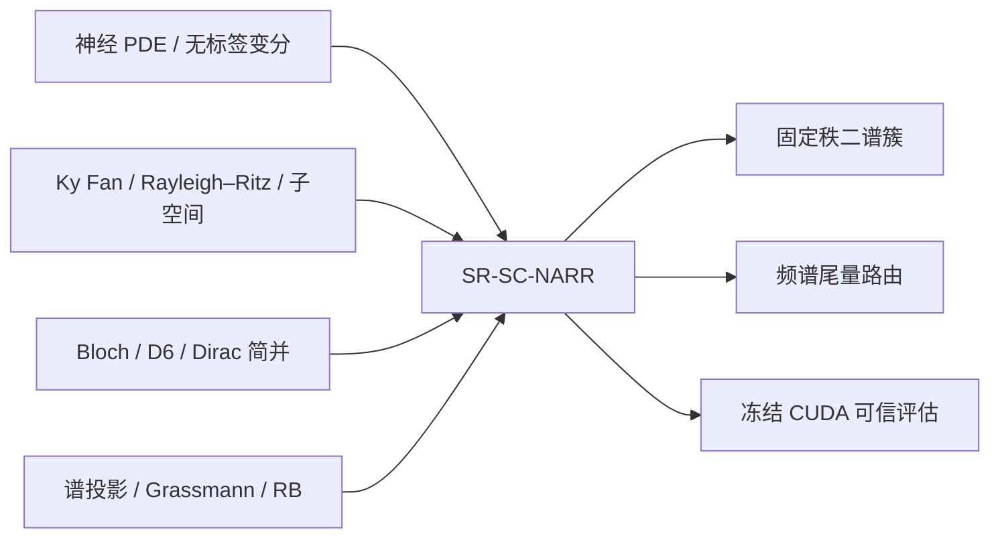

# SR-SC-NARR 文献核查矩阵（投稿工作版）

更新日期：2026-08-28
适用对象：参数化二维周期 Bloch–Schrödinger PDE 的最低秩二谱投影求解器 **SR-SC-NARR**

## 1. 一句话结论

SR-SC-NARR 与已有工作的**共同零件很多**：神经网络求 PDE 本征问题、Ky Fan/trace 多本征对目标、神经子空间、Rayleigh–Ritz、参数化 Bloch 能带、Grassmann/谱投影以及 reduced basis 都已有正式论文。因而，论文不能把这些单项写成首创。

本轮核查尚未发现一篇工作同时采用下列完整组合：

1. 无标签、单一参数网络学习二维 Bloch–Schrödinger 算子的固定秩低能谱投影；
2. 把内部简并/交叉视为同一谱簇，而不追踪可交换的逐带标签；
3. 使用与三角倒格子一致的 D6 频谱截断；
4. 依据势能高频尾量在纯 Fourier 与神经增广 Rayleigh–Ritz 试探空间之间路由；
5. 在冻结的多 family、多 split、CUDA 协议下同时比较投影误差、特征值误差、时延与数值完整性。

这只能支持谨慎表述：“**在本次截至 2026-08-28 的公开文献核查中，未发现完整同构方法**”，不能写“世界首创”。若论文只强调“Ky Fan + 神经网络”或“用网络求两个本征态”，创新重叠风险为高；若把贡献限定为“对称一致、频谱粗糙度路由的固定秩谱簇求解机制及其冻结验证”，重叠风险降为中等。

## 2. 核查方法与纳入边界

- 本地全文：`01_文献库` 的 39 份 PDF；其中部分是正式论文的作者稿/预印本，发表状态以 DOI、期刊页或会议官方页为准。
- 继承核查：旧稿中 15 条已核验引用。
- 扩展核查：期刊官方页、Crossref/DOI、PMLR、OpenReview、NeurIPS、IJCAI 与 arXiv 原始记录。
- 纳入主矩阵：共 66 篇，含 **50 篇正式期刊**、11 篇正式会议、1 篇 workshop、3 篇预印本与 1 篇学位论文。
- “本地”表示存在全文 PDF；“扩展”表示通过正式元数据页补入。题名、作者、年份、venue 与 DOI/官方 URL 已交叉核对。
- 未能确认正式发表状态的工作明确按“预印本/学位论文”处理；未核实条目不进入 `REFERENCES_VERIFIED.bib`。

## 3. A 组：直接近邻与本征/子空间神经方法

| ID | 论文（状态；来源） | 与 SR-SC-NARR 的相同点 | 关键差异 | 在本文中的引用用途 | 重叠风险 |
|---|---|---|---|---|---|
| A01 | Wang & Xie, *Computing multi-eigenpairs...*, JCP 2024, DOI `10.1016/j.jcp.2024.112928`（期刊；本地） | 神经网络、trace 型多本征对、无标签 | 高维张量网络逐本征对；非 Bloch 参数族、非固定秩交叉谱投影、无路由 | 最重要的 trace/Ky Fan 公式级基线 | 高 |
| A02 | Dai, Fan & Sheng, *Subspace method based on neural networks...*, CNSNS 2026, DOI `10.1016/j.cnsns.2026.110060`（期刊；本地） | 神经生成子空间，再做 Galerkin/Ritz | 不是摊销 Bloch 谱簇；未以 D6 和内部简并为核心 | 神经子空间 + Galerkin 最近期刊基线 | 高 |
| A03 | Rowan et al., *Solving Engineering Eigenvalue Problems...*, IJNME 2025, DOI `10.1002/nme.70209`（期刊；本地） | Rayleigh 商、正交化、神经本征函数 | 逐模态求解；不处理参数化 Bloch 内部交叉投影 | 逐本征函数期刊基线 | 高 |
| A04 | Chang et al., *Shape Space Spectra*, ACM TOG 2025, DOI `10.1145/3731148`（期刊；本地） | 一个网络跨参数族求多个本征函数；处理重数处模态交换 | 有监督/几何谱场，动态重排具体模态；不是无标签 Bloch 固定秩投影 | 计算机图形学强平行论文和创新边界 | 高 |
| A05 | Fanaskov et al., *Deep Learning for Subspace Regression*, ICLR 2026（会议；本地） | 直接回归参数依赖子空间，使用 Grassmann 型损失 | 需要预计算标签；不由 Bloch 算子变分训练 | 监督子空间性能上界 | 高 |
| A06 | Ryu et al., *Operator SVD with Neural Networks...*, ICML 2024（会议；本地） | 神经低秩函数空间、隐式正交与谱目标 | 学算子 SVD，不是自伴 PDE 的参数化低能 Bloch 谱簇 | 低秩谱学习方法背景 | 中 |
| A07 | Jin, Mattheakis & Protopapas, *PINNs for Quantum Eigenvalue Problems*, IJCNN 2022, DOI `10.1109/IJCNN55064.2022.9891944`（会议；本地） | 无标签、方程驱动的量子本征求解 | 逐态 PINN、低维例题；无参数化子空间、无 Fourier–Ritz 路由 | 量子本征 PINN 基线 | 高 |
| A08 | Hsu et al., *Equation-driven Neural Networks for Periodic Quantum Systems*, NeurIPS ML4PS 2024（workshop；本地） | 二维周期量子、Bloch 参数、方程驱动 | 学能量与具体 Bloch 波函数；未显式学习交叉处秩二投影 | 最直接的周期量子神经近邻 | 高 |
| A09 | Wu et al., *Energy-embedded Neural Solvers...*, PRA 2025, DOI `10.1103/s3qz-xdgp`（期刊；本地） | 单网络覆盖多个量子态/能量 | 一维逐态能量嵌入；非二维 Bloch 谱簇 | 量子神经本征期刊近邻 | 中 |
| A10 | Kovacs et al., *Conditional physics informed neural networks*, CNSNS 2022, DOI `10.1016/j.cnsns.2021.106041`（期刊；本地） | 条件网络覆盖 PDE 参数族 | 一般 PINN 初边值问题；非本征子空间、非 Bloch | 参数化无标签网络先例 | 中 |
| A11 | Cheung et al., *Theory and numerics of subspace approximation...*, AMC 2026, DOI `10.1016/j.amc.2025.129722`（期刊；扩展） | 以子空间而非单向量逼近本征问题 | 非神经摊销 Bloch 求解器；不含数据驱动路由 | 子空间近似理论与误差语言 | 高 |
| A12 | Peterseim et al., *Neural network acceleration... nonlinear Schrödinger eigenvalue problems*, JCAM 2026, DOI `10.1016/j.cam.2026.117414`（期刊；本地） | 神经网络增广/加速传统本征迭代 | 非线性 Gross–Pitaevskii；网络预测迭代轨迹，不学参数化谱簇 | “神经 + 数值求解器”可发表机制证据 | 中 |
| A13 | Mishra et al., *Eig-PIELM...*, CMAME 2026, DOI `10.1016/j.cma.2025.118674`（期刊；本地） | 无网格神经本征 PDE 求解 | 极限学习机和代数投影；非 Bloch、非谱投影摊销 | 新近本征神经期刊基线 | 中 |
| A14 | Jiang et al., *FieldTNN-based... Maxwell eigenvalue problems*, JCP 2026, DOI `10.1016/j.jcp.2025.114605`（期刊；本地） | 多本征对、变分/张量神经试探空间 | Maxwell 与散度约束；非 Bloch 参数谱簇 | 不同 PDE 本征类型的强期刊对照 | 中 |
| A15 | Bi et al., *FC-PINNs... neutron diffusion eigenvalue problem*, JCP 2025, DOI `10.1016/j.jcp.2025.114311`（期刊；扩展） | PINN 求 PDE 本征值/本征函数 | 核扩散界面问题；固定点约束避免零解，非子空间 | 说明期刊对本征 PINN 的约束与基线要求 | 中 |
| A16 | Bertrand, Boffi & Halim, *Data-driven ROM for parametric PDE eigenvalue problems...*, JCP 2023, DOI `10.1016/j.jcp.2023.112503`（期刊；本地） | 参数化本征问题、低维子空间、交叉测试 | GPR/POD 依赖离线高保真标签；不是方程驱动神经摊销 | 监督/非侵入式参数本征 ROM 对照 | 高 |
| A17 | Grubišić, Saarikangas & Hakula, *Stochastic collocation... eigenspaces...*, Numer. Math. 2023, DOI `10.1007/s00211-022-01339-3`（期刊；本地） | 参数化算子的谱簇/本征空间；外部谱隙下良定 | 稀疏多项式配点，不是神经网络 | 证明内部交叉时学习整体谱簇合理 | 高 |
| A18 | Dölz & Ebert, *UQ of eigenvalues and eigenspaces with higher multiplicity*, SIAM JNA 2024, DOI `10.1137/22M1529324`（期刊；本地） | 高重数时应研究本征空间而非具体向量 | 随机算子 UQ 与 Fréchet 导数；非神经求解 | 简并谱簇动机与数学合法性 | 高 |
| A19 | Li, Sun & Zhang, *Deep Eigenspace Network...*, arXiv:2512.20058（预印本；本地） | 参数到本征空间映射、mode switching、Ritz 后处理 | 非自伴 Steklov；监督式 FNO/POD 标签 | 最新最危险的概念近邻，必须主动区分 | 高 |
| A20 | Wang et al., *STNet...*, NeurIPS 2025（会议；本地） | 神经算子本征问题、谱变换、低谱隙意识 | 迭代求单问题的本征函数；不学 Bloch 固定秩投影 | 最新神经本征会议基线/相关工作 | 中 |
| A21 | Yang, Du & Liu, *Learning Laplacian Eigenspace...*, SIGGRAPH 2026, DOI `10.1145/3799902.3811185`（会议；本地） | 直接预测低频 eigenspace，避免逐模态不稳定 | 点云 Laplace–Beltrami，有监督且面向几何任务 | 证明“学 eigenspace”本身已很拥挤 | 高 |
| A22 | Mattheakis et al., *First principles PINN for quantum wavefunctions and eigenvalue surfaces*, arXiv:2211.04607（预印本；本地） | 参数化 Schrödinger 本征面、方程驱动 | 分子离子与逐态波函数；非 Bloch 谱投影 | 参数化量子 PINN 先例 | 高 |
| A23 | Mian, *Physics-Informed Neural Solvers for Periodic Quantum Eigenproblems*, arXiv:2512.21349（硕士论文；本地） | honeycomb、Dirac、Bloch PINN | 学具体波函数与能带；非固定秩投影/路由 | 警告二维 honeycomb 本身不是创新 | 高 |
| A24 | Reddig et al., *Active Sampling... Dominant Subspaces...*, IJNME 2026, DOI `10.1002/nme.70227`（期刊；本地） | 参数空间中的子空间选择/自适应 | ROM 插值点主动采样；非 Bloch 无标签求解 | 路由/采样思想的邻近依据 | 中 |
| A25 | Zhang et al., *Projected Inverse Iteration... Neural Quantum States*, arXiv:2606.07825（预印本；本地） | 投影、近简并、神经量子态与本征迭代 | 多体基态 NQS；不做参数化 Bloch 谱簇 | 最新量子神经迭代背景 | 中 |
| A26 | Liao, Shen & Peng, *Boundary-aware Neural Model Reduction for PDEs*, SIGGRAPH 2026, DOI `10.1145/3799902.3811153`（会议；本地） | 参数化 PDE 的神经增广降阶 | 几何/边界参数 ROM；非本征谱簇 | 计算机图形学的神经 ROM 平行路线 | 低 |

## 4. B 组：神经 PDE、神经算子与训练机制背景

| ID | 论文（状态；来源） | 与 SR-SC-NARR 的相同点 | 关键差异 | 引用用途 | 重叠风险 |
|---|---|---|---|---|---|
| B01 | Raissi, Perdikaris & Karniadakis, PINNs, JCP 2019, DOI `10.1016/j.jcp.2018.10.045`（期刊） | 方程驱动、无标签神经 PDE | 点态 residual PINN；本文为 Fourier–Galerkin/变分子空间 | 领域起点与术语边界 | 低 |
| B02 | E & Yu, Deep Ritz, CMS 2018, DOI `10.1007/s40304-018-0127-z`（期刊） | 变分能量训练神经试探函数 | 普通边值问题；无参数化本征谱簇 | 变分神经 PDE 基础 | 中 |
| B03 | Sirignano & Spiliopoulos, DGM, JCP 2018, DOI `10.1016/j.jcp.2018.08.029`（期刊） | 神经网络近似 PDE 解 | 点态 PDE 训练、非谱问题 | 神经 PDE 历史背景 | 低 |
| B04 | Lu et al., DeepXDE, SIAM Review 2021, DOI `10.1137/19M1274067`（期刊） | PINN 工程与自动微分 | 本文不用通用 collocation 框架 | 软件/方法综述 | 低 |
| B05 | Wang, Teng & Perdikaris, gradient pathologies, SISC 2021, DOI `10.1137/20M1318043`（期刊） | 神经 PDE 训练稳定性 | 本文主要是变分/Ritz 与路由，不靠多项 residual 平衡 | 解释传统 PINN 风险 | 低 |
| B06 | Wang, Yu & Perdikaris, NTK PINN failure, JCP 2022, DOI `10.1016/j.jcp.2021.110768`（期刊） | 讨论 PINN 失效机制 | 不涉及本征交叉/子空间 | 说明不用普通 residual PINN 的原因 | 低 |
| B07 | Jagtap, Kharazmi & Karniadakis, conservative PINNs, CMAME 2020, DOI `10.1016/j.cma.2020.113028`（期刊） | 物理结构与域分解 | 守恒律接口；非 Bloch 谱问题 | 结构保持 PINN 背景 | 低 |
| B08 | Jagtap & Karniadakis, XPINNs, CiCP 2020, DOI `10.4208/cicp.OA-2020-0164`（期刊） | 域分解神经 PDE | 空时域分解；非 Fourier 子空间路由 | 方法背景 | 低 |
| B09 | Wu et al., adaptive sampling study, CMAME 2023, DOI `10.1016/j.cma.2022.115671`（期刊） | 依据难度信号动态分配计算 | residual 采样；本文依据势谱尾量选试探空间 | 路由机制的邻近但不同依据 | 中 |
| B10 | Toscano et al., variational residual adaptivity, npj AI 2026, DOI `10.1038/s44387-026-00084-4`（期刊；本地） | 以可解释指标控制适应性 | residual 权重/采样；非本征子空间与频谱字典 | 自适应机制应有可解释准则的证据 | 中 |
| B11 | Lu et al., DeepONet, NMI 2021, DOI `10.1038/s42256-021-00302-5`（期刊） | 参数到函数/算子映射的摊销思想 | 有监督算子学习；本文训练不用真实谱标签 | 神经算子基线背景 | 中 |
| B12 | Li et al., Fourier Neural Operator, ICLR 2021（会议） | Fourier 表示、参数化算子映射 | 数据监督；FNO 是卷积算子，本文输出有限 Fourier 子空间 | 区分 Fourier 特征与 FNO | 中 |
| B13 | Kovachki et al., *Neural Operator...*, JMLR 2023（期刊） | 函数空间映射与网格无关表述 | 通用有监督 operator learning | 神经算子理论/综述 | 低 |
| B14 | Li et al., PINO, ACM/IMS JDS 2024, DOI `10.1145/3648506`（期刊） | 物理约束与算子学习结合 | 需要解场数据或 residual；非本征谱投影 | 物理信息神经算子基线 | 中 |
| B15 | Hao et al., PINNacle, NeurIPS 2024, DOI `10.52202/079017-2442`（会议；本地） | 多 PDE、多方法、公平预算评估 | 无 Bloch 本征任务 | 实验协议设计依据 | 低 |
| B16 | Wei et al., PDENNEval, IJCAI 2024, DOI `10.24963/ijcai.2024/573`（会议；本地） | 区分函数学习与算子学习并做系统基准 | 不覆盖参数本征谱簇 | 方法分类和评价规范 | 低 |
| B17 | Krishnapriyan et al., PINN failure modes, NeurIPS 2021（会议） | 强调课程/优化与真实失效 | 一般动力 PDE | 反对仅看训练 residual | 低 |
| B18 | Cuomo et al., PINN overview, JSC 2022, DOI `10.1007/s10915-022-01939-z`（期刊） | 神经 PDE 方法综述 | 不针对谱问题 | 相关工作总览 | 低 |
| B19 | Grossmann et al., PINN vs FEM, IMA J. Appl. Math. 2024, DOI `10.1093/imamat/hxae011`（期刊；本地） | 用传统数值法公平比较 | 一般 PDE、非摊销本征族 | 必须保留强 PWE/eigh 基线的依据 | 低 |
| B20 | McGreivy & Hakim, weak baselines/reporting bias, NMI 2024, DOI `10.1038/s42256-024-00897-5`（期刊；本地） | 强调强基线、时延和诚实主张 | 流体 PDE 综述 | 限定 Pareto 主张、避免过度宣称 | 低 |
| B21 | Takamoto et al., PDEBench, NeurIPS 2022, DOI `10.52202/068431-0117`（会议） | 多任务、标准化指标、复现 | 时变 PDE 数据集 | benchmark 报告规范 | 低 |
| B22 | Kapoor & Narayanan, leakage/reproducibility, *Patterns* 2023, DOI `10.1016/j.patter.2023.100804`（期刊） | 冻结 split、避免泄漏、独立确认 | 通用 ML 科学方法论 | 冻结 test 和 provenance 的依据 | 低 |
| B23 | Berner et al., function-space architectures, NMI 2026, DOI `10.1038/s42256-026-01267-z`（期刊；本地） | 强调架构应与函数空间一致 | 通用 operator learning；非本征谱簇 | 解释为何 Fourier/D6 表示不是随意网络堆叠 | 中 |

## 5. C 组：Ky Fan、谱投影、Bloch/Dirac 与降阶理论

| ID | 论文（状态；来源） | 与 SR-SC-NARR 的相同点 | 关键差异 | 引用用途 | 重叠风险 |
|---|---|---|---|---|---|
| C01 | Ky Fan, *On a Theorem of Weyl... I*, PNAS 1949, DOI `10.1073/pnas.35.11.652`（期刊） | 最低若干本征值的 trace 变分原理 | 纯矩阵理论 | Ky Fan 目标的原始出处 | 高（基础原理） |
| C02 | Davis & Kahan, eigenvector rotation, SIAM JNA 1970, DOI `10.1137/0707001`（期刊） | 外部谱隙控制谱子空间扰动 | 非神经/非 Bloch | 投影误差与谱隙解释 | 高（基础理论） |
| C03 | Edelman, Arias & Smith, orthogonality-constrained geometry, SIMAX 1998, DOI `10.1137/S0895479895290954`（期刊） | Stiefel/Grassmann 子空间几何 | 通用优化理论 | 基底不变损失与正交化背景 | 中 |
| C04 | Björck & Golub, angles between subspaces, Math. Comp. 1973, DOI `10.1090/S0025-5718-1973-0348991-3`（期刊） | 主角/投影距离 | 通用数值线性代数 | 子空间误差指标定义 | 中 |
| C05 | Knyazev & Argentati, principal angles, SISC 2002, DOI `10.1137/S1064827500377332`（期刊） | 加权内积下子空间角与扰动 | 通用矩阵理论 | 非正交基/质量矩阵情形的理论背景 | 中 |
| C06 | Boffi, *Finite element approximation of eigenvalue problems*, Acta Numerica 2010, DOI `10.1017/S0962492910000012`（期刊） | PDE 本征参考解、Galerkin 谱逼近 | FEM 理论；非神经 | 参考解与 Ritz 收敛依据 | 低 |
| C07 | Pau, reduced-basis band structure, PRE 2007, DOI `10.1103/PhysRevE.76.046704`（期刊；本地） | Bloch 能带、多查询、低维基 | 传统 RB，需快照/离线本征解；不处理神经谱簇路由 | 最直接传统 Bloch ROM 基线 | 高 |
| C08 | Horger, Wohlmuth & Dickopf, simultaneous RB eigen approximation, ESAIM M2AN 2017, DOI `10.1051/m2an/2016025`（期刊；本地） | 多个参数本征值、重数依赖、RB | 传统 greedy/RB 与误差估计 | 多本征值与重数的传统强基线 | 高 |
| C09 | Fefferman & Weinstein, honeycomb Dirac points, JAMS 2012, DOI `10.1090/S0894-0347-2012-00745-0`（期刊；本地） | honeycomb Schrödinger、Dirac 简并 | 严格谱理论；无数值/神经求解 | PDE、D6 对称和 Dirac 物理合法性 | 高（问题定义） |
| C10 | Lee-Thorp, Weinstein & Zhu, elliptic honeycomb operators, ARMA 2019, DOI `10.1007/s00205-018-1315-4`（期刊；本地） | honeycomb 对称、Dirac 点、边缘态 | Maxwell/椭圆算子谱理论 | 说明结论可迁移到更广 Bloch 算子 | 中 |
| C11 | Haasdonk et al., certified RB-ML-ROM, SISC 2023, DOI `10.1137/22M1493318`（期刊；本地） | 传统 ROM + ML、在线适应与证据链 | 普通参数 PDE surrogate；非本征谱簇 | “神经增广数值法”与认证理念依据 | 中 |
| C12 | Mera & Mitscherling, degenerate flat-band geometry, PRB 2022, DOI `10.1103/PhysRevB.106.165133`（期刊；本地） | 简并能带应以 Grassmann/投影几何描述 | 量子几何分析，不是求解器 | 固定秩投影而非逐带标签的物理依据 | 高 |
| C13 | Mitscherling, Avdoshkin & Moore, gauge-invariant projector calculus, PRB 2025, DOI `10.1103/qscv-qxqt`（期刊；本地） | 用 projector 获得规范不变量 | 观测量/量子几何，不是神经求解 | “投影是物理对象”论据 | 高 |
| C14 | Haldane, quantum Hall model, PRL 1988, DOI `10.1103/PhysRevLett.61.2015`（期刊） | honeycomb/Dirac 能带拓扑背景 | 紧束缚模型与拓扑相，不是本文算法 | 物理背景，不作方法近邻 | 低 |
| C15 | Panati, triviality of Bloch bundles, AHP 2007, DOI `10.1007/s00023-007-0326-8`（期刊） | Bloch 子空间/投影族的几何规则性 | Bloch bundle 理论；非数值求解 | 全局光滑表述的边界与 gauge 问题 | 中 |
| C16 | Hermann, Schätzle & Noé, neural Schrödinger equation, Nature Chemistry 2020, DOI `10.1038/s41557-020-0544-y`（期刊） | 神经网络变分求量子本征态 | 多电子基态 wavefunction ansatz；非周期参数谱簇 | 神经量子求解的高影响背景 | 低 |
| C17 | Pfau et al., FermiNet, PR Research 2020, DOI `10.1103/PhysRevResearch.2.033429`（期刊） | 神经变分量子求解 | 反对称多电子基态；非 PDE Bloch 谱投影 | 区分 neural quantum states 与本文 | 低 |

## 6. 机制可行性的“证据链”，不是凭空组合

| 本文机制 | 已有可核查证据 | 可支持的说法 | 不能支持的说法 |
|---|---|---|---|
| 学谱簇而不是逐带标签 | Grubišić 2023；Dölz–Ebert 2024；Mera–Mitscherling 2022；Chang 2025；DEN 2026 | 内部本征值交叉时，固定秩谱投影比单一本征向量更稳定/可辨识 | “首次提出学 eigenspace” |
| Ky Fan trace + 正交子空间 | Ky Fan 1949；Wang–Xie 2024；Dai 2026 | 无需逐态标签即可优化低能子空间 | “首次把 trace 用于神经本征求解” |
| 神经方向增广传统 Ritz 空间 | Dai 2026；Peterseim 2026；Haasdonk 2023 | 神经模块可作为传统数值空间/迭代的补充，而不是替代全部数值结构 | “任意神经+Ritz 拼接都新颖” |
| Bloch 多查询降阶 | Pau 2007；Horger 2017；Bertrand 2023 | 对参数/波矢族做离线—在线摊销有明确计算动机 | “首个参数化 Bloch 快速求解器” |
| D6 对称一致的 Fourier 字典 | Fefferman–Weinstein 2012；Lee-Thorp 2019；Pau 2007 | honeycomb/三角倒格子必须尊重其正确对称与谱截断 | “D6 对称本身是算法发明” |
| 势能频谱尾量路由 | Wu 2023；Toscano 2026；Reddig 2026 提供适应性/主动选择先例 | 可将“可解释的廉价难度指标决定计算资源”作为本文具体新机制 | “自适应采样/路由概念首次出现” |
| 冻结、强基线、独立 CUDA 确认 | PINNacle；PDENNEval；Grossmann；McGreivy–Hakim；Kapoor–Narayanan | 预注册阈值、强 PWE/Ritz 基线、均值/尾部/时延共同报告符合可信 SciML 趋势 | “一次成功运行即可证明普适优越” |

## 7. 对创新性和可发表性的严格判断

### 可保留的核心主张

> We introduce a symmetry-consistent, spectral-roughness-routed neural augmentation of Rayleigh–Ritz for amortized, label-free approximation of a fixed-rank low-energy Bloch spectral projector across internal band crossings.

该主张的真正新意是**路由对象、对称一致试探字典、固定秩谱投影目标和冻结验证的整体机制**，不是 MLP、Ky Fan、Fourier、正交化或 Ritz 任一单项。

### 需要主动承认的共同点

1. Wang–Xie 与 Dai 已经把 trace/神经子空间用于多本征问题；
2. Fanaskov、Chang、DEN、NEO 已经直接学习参数化 subspace/eigenspace；
3. Hsu 与 Mian 已经把 PINN 用于二维周期量子/Bloch/Dirac；
4. Pau、Horger、Bertrand 已经在参数本征问题中使用 reduced basis/离线—在线加速；
5. Grubišić、Dölz–Ebert、Mera、Mitscherling 已经说明交叉或简并时 projector/eigenspace 是正确对象。

### 最容易被审稿人攻击的点

1. **组合式创新**：如果正文不把路由准则写成可复现算法并做移除/替换消融，审稿人会认为只是“Fourier basis + 两个 neural vectors + Ritz”。
2. **计算优势边界**：当前正式结果支持相对 Fourier-25 的精度提升，以及相对 shell-37 的 Pareto 权衡；不支持全面快于直接 `eigh` 或全面优于 shell-37。
3. **直接基线实现**：Wang–Xie、Dai 当前是公式级适配，必须在论文中明确标注，不能伪装为作者官方代码复现。
4. **问题族宽度**：两种 honeycomb potential family 足以形成一篇聚焦论文，但 SCI 三区审稿人可能要求额外 lattice/potential family 或更强 OOD。
5. **理论强度**：至少应给出基底不变性、Hermitian Ritz、外部谱隙下投影稳定性、路由复杂度与 Pareto 成本分析；不能只给经验结果。

### 当前发表判断

- **SCI 四区**：在保持真实主张、补齐成图和完整双语稿后，有条件可投。
- **SCI 三区**：方法与正式 CUDA 数据已经达到继续打磨的基础，但仍建议补齐一组额外势族/尺度泛化、强传统数值基线的摊销临界点，以及一段更完整的投影误差理论说明。
- **不建议退回普通 PINN**：普通 residual PINN 会同时面临谱偏置、损失权重、零解/重复态、简并标签交换和强 PWE 基线五类风险，反而更难形成可信创新。

## 8. 投稿正文的建议引用骨架

- 引言：B01、B11–B14、A07–A10、C09。
- 相关工作“神经本征/子空间”：A01–A06、A11–A21。
- 问题定义与数学动机：C01–C10、C12–C15。
- 方法设计：A02、A11–A12、B09–B10、C11。
- 实验规范与威胁：B15–B22。
- 讨论：明确与 A01、A02、A04、A05、A08、A16、A19、C07 的差异。

## 9. 核验限制

本矩阵是投稿前的高强度公开来源核查，不等于 Web of Science/Scopus 的法律意义“查新证明”。最终投稿前仍应以学校订阅数据库进行题名、摘要与组合关键词复检，尤其关注 2026 年后续发表的 DEN、Projected Inverse Iteration 与周期量子神经求解工作。
