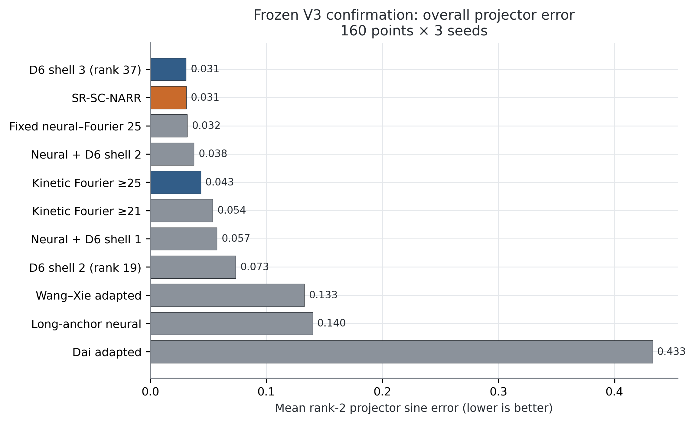
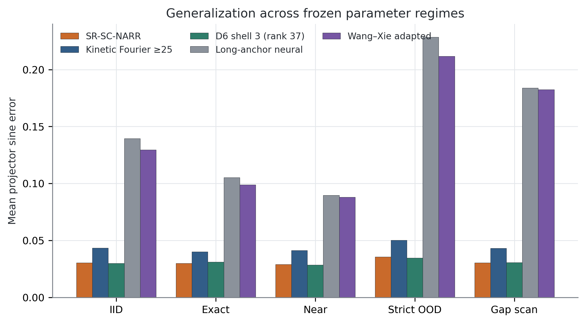
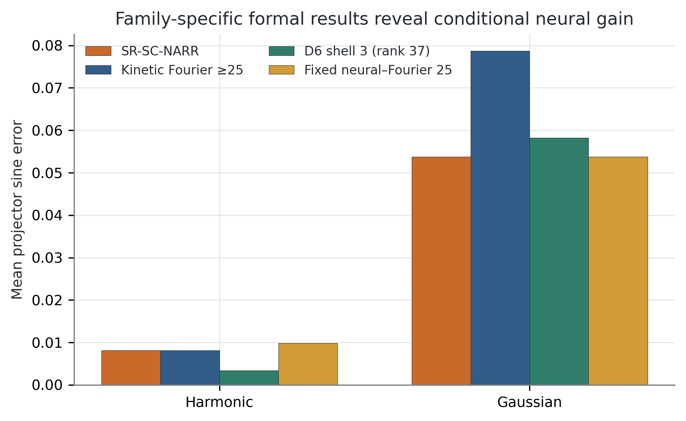
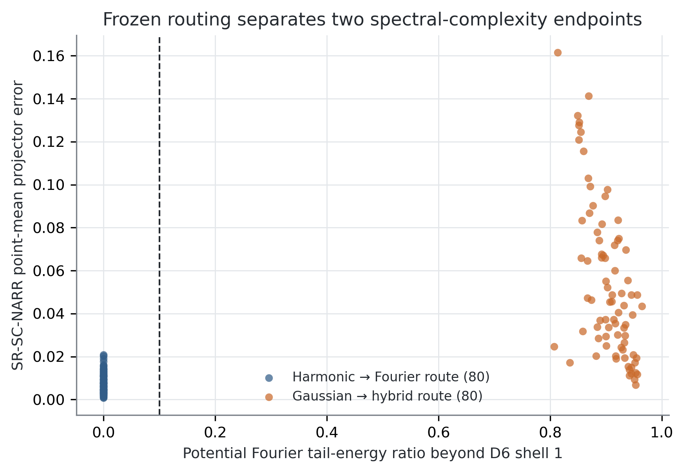
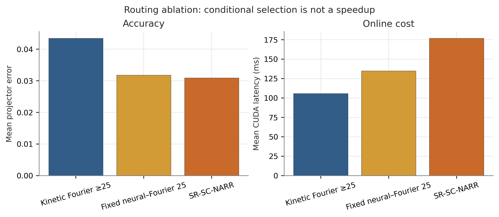
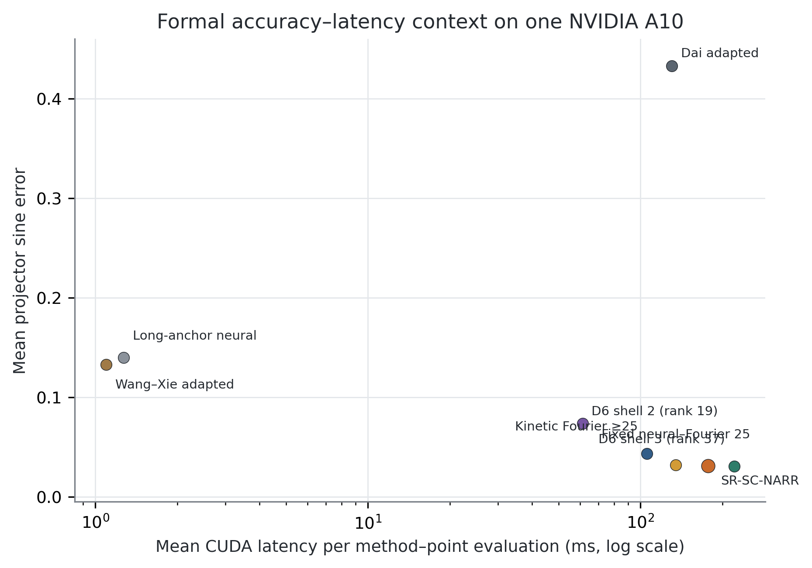
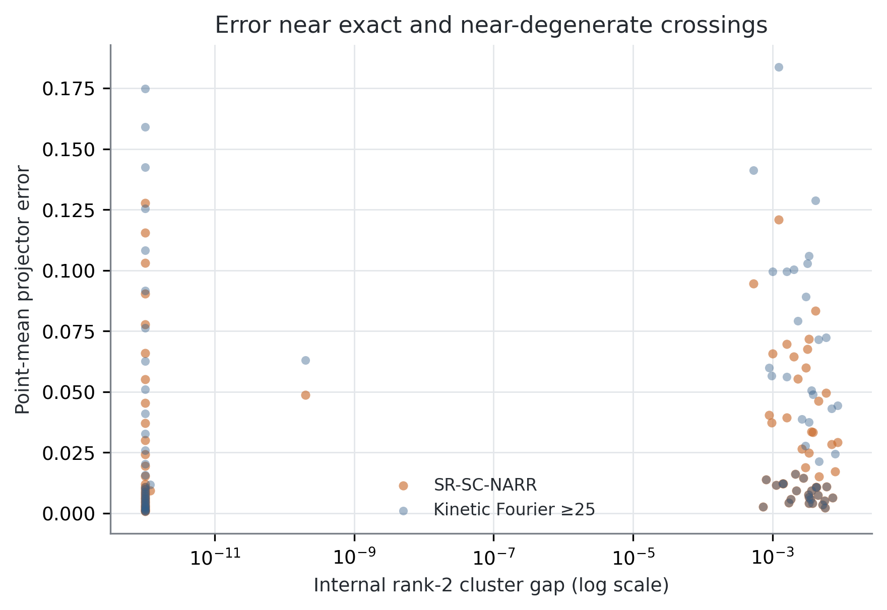

# 面向能带交叉参数化 Bloch 谱簇的谱复杂度门控神经增强方法

> 中文论文初稿 v1.0，2026-08-28。本稿所有实验数字只来自冻结的 V3 正式证据。作者、
> 单位、ORCID、基金、CRediT 角色和目标期刊排版仍需作者最终确认。

## 摘要

参数化偏微分本征问题需要重复求解，而内部本征值交叉会使逐条排序的本征函数成为不稳定的
学习目标。本文研究二维周期 Bloch–Schrödinger 算子的最低 rank-2 谱投影，势函数包括
谐波蜂窝势和局域 Gaussian 蜂窝势。本文提出 SR-SC-NARR：一种基于势谱粗糙度路由、
满足 D6 对称性的神经增强 Rayleigh–Ritz 求解器。轻量级 SiLU 网络通过 generalized-trace
变分目标进行无标签训练，输出两个依赖参数的复值试探方向。推理时，仅利用势函数的 Fourier
尾能量比例，在关闭动能简并边界的 Fourier 空间与神经–Fourier 混合空间之间选择。倒空间
字典严格匹配代码采用的正交叉项动能度量；Fourier 列的 Hamiltonian 作用解析计算，两个神经列
使用自动微分，成对正交化保持 ((W,HW)) 一致性，约化矩阵显式 Hermitian 化。

正式实验只打开一次，包含160个物理参数点、2个势族、5种参数区域、3个封存网络种子、
11种方法和消融，共5,280行配对评价。SR-SC-NARR 的 rank-2 projector sine error 均值为
0.03093，p95 为0.10568，两个最低本征值的平均绝对误差为0.00984。相对关闭简并边界、
minimum-rank-25 的 kinetic Fourier 对照，projector error 降低28.76%；按照“势族×split”
分层的物理点 bootstrap 95%区间为[28.08%, 29.44%]。该提升具有明确条件性：全部 harmonic
样本均选择 Fourier 分支并与对照完全一致，全部 Gaussian 样本均选择 hybrid 分支并降低
31.75%。相对完整 rank-37 D6 shell，本文方法 projector error 高0.42%，但本征值误差低
12.75%、延迟低19.84%、trial rank 仅25–27。实验支持“条件性神经增强与 Pareto 取舍”，
不支持“神经网络普遍优于 Fourier”或“路由已能在两个端点之间泛化”的强主张。

**关键词：** 神经偏微分方程求解器；Bloch–Schrödinger 方程；谱投影；本征值交叉；
Rayleigh–Ritz；Fourier 谱方法；科学机器学习

## 1. 引言

神经 PDE 求解器的目标，是学习一族函数或算子映射，从而摊销重复的数值求解成本。PINN 将
微分方程、边界条件和观测信息写入训练目标[1]，conditional PINN 进一步处理参数化问题族[2]。
与普通初边值问题相比，本征 PDE 还需同时处理未知本征值、齐次残差的零解、多个状态之间的
归一化和正交性，以及本征值重数造成的本征向量不唯一性。

二维蜂窝 Bloch 算子可在 Brillouin 区顶点形成 Dirac 锥形交叉[11]。在内部交叉附近，
“第一条能带本征函数”和“第二条能带本征函数”可能交换或在二维空间内任意旋转。若直接拟合
逐带标签，模型会把基底选择误当成物理误差。只要最低两态和第三态之间存在外部谱隙，它们
共同张成的二维谱簇及其 projector 仍然良定[7,15]。因此，本文学习的不是两条带各自的标签，
而是最低 rank-2 不变子空间。

现有文献已经提供许多组成部分。Wang–Xie 通过 trace/Ky Fan 思路同时求多个本征对[3]；
Rowan 等将 Rayleigh quotient 与 Gram–Schmidt 用于工程本征问题[4]；Dai 等以神经网络
构造试探子空间，再执行 Galerkin 求解[5]；Shape Space Spectra 通过动态模态重排处理重数[6]；
监督式 Grassmann 回归可学习参数到子空间的映射[8]；经典 reduced basis 已用于能带和参数化
多重本征空间[9,10,12]。因此，本文不把 Ky Fan、谱投影、Fourier 基、Gram–Schmidt、
Galerkin 或 Rayleigh–Ritz 单独声称为原创。

本文关注更窄但可检验的问题：当紧凑 Fourier 字典不足以描述频谱复杂势函数时，无标签神经
方向能否改善低秩 Ritz 空间；当 Fourier 已足够时，能否仅根据势函数本身避免无收益的神经
增强；以及该组合能否在严格冻结的一次性实验中与更高 rank 的 Fourier 对照形成合理的
精度–成本取舍。

本文贡献如下：

1. **交叉感知的 PDE 目标。** 训练与评价均以最低 rank-2 谱空间/projector 为对象，对相位、
   排序和簇内 unitary 旋转不敏感。
2. **与动能度量一致的试探空间。** 使用与 (m_1^2+m_2^2+m_1m_2) 匹配的 D6 闭合壳层，
   并保留动能排序边界上的全部 ties，避免任意切断简并多重态。
3. **无标签条件神经增强。** 势函数 Fourier 尾能量决定是否调用 neural–Fourier 混合空间，
   路由不读取 projector 标签或测试误差。
4. **算子一致的紧凑求解。** Fourier Hamiltonian 解析装配，仅两个神经列使用自动微分；
   网格积分归一化常数 detach；同一线性变换同步作用于 (W) 和 (HW)；约化矩阵显式
   Hermitian 化。
5. **可审计证据。** 独立 pilot、cutoff/grid 收敛审计和唯一一次160点 CUDA confirmation
   均绑定 suite、reference、checkpoint、源码、rows 和 evidence 的 SHA-256。

正式实验的核心结论必须限定为“两个谱复杂度端点上的安全条件选择”。harmonic 与 Gaussian
的尾能量之间存在很大空白，当前证据尚不能证明阈值附近或新势族上的路由泛化。

## 2. 相关工作

### 2.1 神经 PDE 与神经本征求解

普通 PINN 通过点态 PDE residual、边界/初值条件和可选数据项训练[1]。本征问题还需规避零解
并表达归一化、正交性和多状态关系。Jin 等在无波函数标签条件下求解量子本征问题[14]；
Kovacs 等用 conditional PINN 表示一族本征问题[2]。这些工作证明了无标签神经本征分析的
可行性，但逐个状态的表示在内部交叉处仍可能不连续。

Wang–Xie 通过 tensor neural network 和 trace 目标联合求多个本征对[3]；Rowan 等证明
Rayleigh quotient 与 Gram–Schmidt 是连续工程本征问题中的可靠组合[4]。本文的
generalized-trace 初始化器继承这些思想。正式实验中的 Wang–Xie 结果是统一 Bloch 框架下的
公式级适配，不是原作者代码的官方复现，不能写成对原方法的普遍否定。

### 2.2 神经子空间与参数化谱空间

Dai、Fan 和 Sheng 训练神经基函数并在其张成空间内求 Galerkin 本征问题[5]，是与本文结构
最接近的期刊工作。本文的差异在于：单一参数条件网络、内部交叉的 Bloch projector 目标、
D6 解析字典、势函数路由和成对 Hamiltonian 装配。本文的 Dai 适配收敛较差，只作为透明的
邻近背景，不作为核心优越性证据。

Chang 等在参数化形状族上学习谱并在重数处动态重排具体模态[6]；Fanaskov 等用预计算标签
进行 Grassmann 子空间回归[8]；本文不为簇内基底分配身份，并且训练不读取 PWE 标签。
Grubišić 等关于外部隔离参数化 eigenspace 的分析[7]为本文的谱簇目标提供理论动机。

### 2.3 Bloch 降阶与周期量子网络

Pau 将 reduced basis 用于重复能带计算[9]；Horger 等研究了参数化多重本征值的同时
reduced-basis 逼近[10]；Haasdonk 等构建了 full-order、reduced-order 与 machine-learning
相结合且可认证的层级链条[12]。这些研究说明，混合神经数值方法不能只报告网络 forward
时间，还需同时报告精度、成本与可靠性。Hsu 等展示了二维周期量子系统的 equation-driven
神经能带学习[13]；Fefferman–Weinstein 给出了蜂窝势和 Dirac 点的数学背景[11]。

本文的创新边界因此很具体：D6 与 tie-closed 解析字典、无标签参数网络、projector 目标、
势谱条件选择、成对算子装配及严格冻结验证的整体组合，而非其中任何传统组件。

## 3. 问题定义

### 3.1 二维 Bloch–Schrödinger 本征 PDE

令周期单元 $\Omega=[0,2\pi)^2$，Bloch 波矢为
$\mathbf k=(k_1,k_2)$，势参数为 $\mu$。求解

\[
\mathcal H_{\mathbf k,\mu}u_j=
\left[\frac12(-i\nabla+\mathbf k)^T
G(-i\nabla+\mathbf k)+V_\mu(\mathbf x)\right]u_j=E_j u_j,
\qquad
G=\begin{bmatrix}1&1/2\\1/2&1\end{bmatrix},
\]

并满足函数及一阶导数周期边界条件。倒格模式
$\mathbf m=(m_1,m_2)$ 的动能为

\[
T(\mathbf m,\mathbf k)=\frac12[(m_1+k_1)^2+(m_2+k_2)^2
+(m_1+k_1)(m_2+k_2)].
\]

谐波蜂窝势定义为

\[
V_{a,\delta}^{\mathrm H}(x,y)=
a[\cos x+\cos y+\cos(x-y)]
+\delta[\sin x-\sin y-\sin(x-y)].
\]

训练范围为 $a\in[0.20,0.80]$、
$\delta\in[-0.08,0.08]$、$k_1,k_2\in[0.28,0.38]$。

局域势由两个周期重复的 Gaussian 子晶格构成。中心为
$c_1=(0,0)$、$c_2=(2\pi/3,4\pi/3)$，权重为
$w_1=1$、$w_2=1+\delta$，周期像为
$n\in\{-1,0,1\}^2$：

\[
V_{a,\sigma,\delta}^{\mathrm G}(x)
=-a\sum_{\ell=1}^2 w_\ell\sum_n
\exp\!\left[-\frac{2}{3\sigma^2}(d_1^2+d_2^2-d_1d_2)\right],
\quad d=x-c_\ell-2\pi n.
\]

其训练范围为 $a\in[1,4]$、$\sigma\in[0.18,0.35]$、
$\delta\in[-0.08,0.08]$。strict-OOD 测试把 Bloch 坐标扩展至
$k_1\in[0.20,0.28]$、$k_2\in[0.38,0.45]$，并扩大势参数范围。

### 3.2 谱簇目标与指标

令 $U_2(\mathbf k,\mu)$ 为最低两个本征态张成的空间，$P_2$ 为其正交 projector。
内部谱隙 $E_2-E_1$ 可以为零，但要求 $E_3-E_2>0$。若预测和参考正交基分别为
$Q,Q_\star$，主指标为

\[
e_{\mathrm{proj}}(Q,Q_\star)=
\sqrt{\frac{2-\lVert Q^*Q_\star\rVert_F^2}{2}}.
\]

它等于两个 principal angles 正弦的 RMS，对簇内所有 unitary 旋转不变。本文还报告最低两
Ritz 本征值 MAE、residual RMS、p95、最大误差、正交误差、原始 Ritz Hermiticity defect、
trial rank、CUDA 延迟和峰值显存。

## 4. SR-SC-NARR 方法

### 4.1 无标签神经粗空间

两个势族分别使用 family-specific 网络。输入为

\[
[\sin x,\cos x,\sin y,\cos y,\mathbf k,\mu],
\]

网络由3个宽度64的 SiLU 隐藏层构成，输出2个复值周期函数的实部和虚部。K 点附近的固定
低能 anchor 以0.1的尺度加到网络输出。对原始列 $Z_\theta$，定义

\[
B_\theta=Z_\theta^*Z_\theta,\qquad A_\theta=Z_\theta^*\mathcal H Z_\theta,
\]

并最小化

\[
\mathcal L_{\mathrm{trace}}=
\operatorname{Tr}[(B_\theta+10^{-6}I)^{-1}A_\theta].
\]

训练不使用 PWE 本征向量、projector 或能带标签。优化器为 Adam，学习率 (10^{-3})，
每步4个参数实例、每实例256个移动后的周期网格点，共665步。正式 checkpoint seeds 为
42、137和251。评价时用复值 modified Gram–Schmidt 得到 rank-2 神经基 $Q_\theta$。

### 4.2 D6 字典与简并边界闭合

与正交叉项动能度量一致的 D6 壳层为

\[
\mathcal S_s=\{(m_1,m_2)\in\mathbb Z^2:
\max(|m_1|,|m_2|,|m_1+m_2|)\le s\}.
\]

(s=1,2,3) 分别包含7、19和37个模式。这里必须使用 (m_1+m_2)，才能与
(m_1^2+m_2^2+m_1m_2) 对应。

对于 nominal rank $r$，在 $\mathcal S_4$ 内按 $T(m,k)$ 排序。若边界动能为
$T_r$，保留所有满足

\[
T(m,k)\le T_r+10^{-7}\max(1,|T_r|)
\]

的模式。这样不会任意切断动能简并多重态。formal 中 nominal rank-25 的实际 rank 为
25或27。

### 4.3 仅由势函数决定的谱路由

在65×65周期网格上计算势函数 Fourier 系数 $\widehat V_m$，定义

\[
\rho(V)=\frac{\sum_{m\notin\mathcal S_1}|\widehat V_m|^2}
{\sum_m|\widehat V_m|^2}.
\]

阈值冻结为0.1。当 $\rho\le0.1$ 时，直接使用 tie-closed minimum-rank-25 kinetic
Fourier 字典。当 $\rho>0.1$ 时，构造
$\mathcal S_2\cup\mathcal K_{21}(k)$，再加入两个神经方向。正交化过程中删除冗余列，
formal trial rank 为25–27。路由不需要同时求两个 candidate，也不访问 reference。

### 4.4 Hamiltonian 装配与紧凑 Ritz 求解

平面波 $\phi_m(x)=e^{im\cdot x}$ 满足

\[
\mathcal H\phi_m=[T(m,k)+V_\mu(x)]\phi_m,
\]

所以 Fourier 列无需二阶 autograd。两个神经列使用自动微分。modified Gram–Schmidt 中，
等权周期积分得到的投影系数与 normalization 对空间坐标视为常量并 detach。同一线性变化同步
作用于 (w) 与 (Hw)，保持数值上的 (H(cw)=cHw)。

接受后的成对列为 ((W,HW))，约化矩阵显式写为

\[
A_W=\frac12[W^*(HW)+(W^*(HW))^*].
\]

取最低两个 Ritz 向量并映射回网格，即得到最终 rank-2 空间。

### 4.5 算法流程

```text
输入：(k, μ)、势族对应的封存网络、周期网格 X
1. 计算 Vμ(X) 与尾能量比例 ρ(Vμ)。
2. 若 ρ ≤ 0.1：
      构造 tie-closed kinetic Fourier 字典 K25(k)；
      解析装配 (W, HW)。
   否则：
      计算并正交化两个神经方向 Qθ；
      构造 S2 ∪ K21(k)；
      将解析 Fourier pairs 加入 (Qθ, HQθ)。
3. 对 (W, HW) 做成对 modified Gram–Schmidt，积分标量 detach。
4. 构造显式 Hermitian 的紧凑 Ritz 矩阵。
5. 返回最低 rank-2 Ritz 子空间及 Ritz 本征值。
```

当网格点数 $N=65^2$、trial rank $r\in[25,27]$ 时，列作用之后的在线复杂度约为
$O(Nr^2+r^3)$。正式 timing 包含当前 FFT 路由诊断本身的时间。

## 5. 实验设计

### 5.1 开发集与正式集严格分离

外部审计发现，旧 V2 把正交叉项动能与负号倒空间壳层混用。V3 修正了 D6 closure、
normalization detach、显式 Hermitian Ritz，并以 tie-closed kinetic control 替换不对称
rank-21 对照。旧 V2/Q3 结果仅作为历史审计，不与本论文数值混合。

24点 V3 pilot 只用于冻结代码、路由、控制和 gate。代码与 pilot 提交后，才生成160点正式
suite、reference、physical-point digest 和 formal manifest。正式评价在 clean CUDA checkout
中只打开一次；全局 marker 阻止第二次打开。

### 5.2 Formal confirmation set

每个势族80个物理点：16个 IID-hidden、16个 exact-cluster、24个 near-cluster、16个
strict-OOD 和8个 gap-scan。exact 点 internal gap $<10^{-3}$，near 点
$<2\times10^{-2}$，全部点 external gap $>10^{-2}$。3个 seeds、11种方法、160个点构成
5,280个唯一 identity。

参考解为 float64 D6 plane-wave expansion，cutoff 24、rank 3、65×65网格。独立审计比较
cutoff 20/24/28，并把 solver basis 从65网格直接周期重采样到97网格比较 projector。

### 5.3 对比与消融

评价矩阵包括 long-anchor、neural+shell1、neural+shell2、fixed hybrid、SR-SC-NARR、
D6 shell2、kinetic Fourier nominal rank21/25、D6 shell3，以及 Wang–Xie 和 Dai 的
公式级 Bloch 适配。神经机制的主要证据来自 Fourier-25、fixed hybrid 和 shell-3；两篇
期刊方法适配仅提供邻近背景。

### 5.4 统计与硬件

bootstrap 共2,000次，先对每个物理点的3个固定 seeds 取均值，再在10个 family×split
strata 内有放回抽样。因此区间条件于这3个 checkpoint，不代表任意重新训练的总体随机性。

正式设备为单张 NVIDIA A10（报告显存23.82GB），PyTorch 2.10.0+cu128、CUDA 12.8、
驱动550.54.15。方法顺序按 point 和 seed 确定性轮换，减少 timing 顺序偏差。峰值 allocated/
reserved 显存为1.24/1.26GB。

## 6. 实验结果

### 6.1 主结果

**表1 正式 projector、本征值和延迟结果。数值越低越好。**

| 方法 | Overall | Near | Strict OOD | Gap scan | Eigenvalue MAE | p95 | 延迟/ms |
|---|---:|---:|---:|---:|---:|---:|---:|
| **SR-SC-NARR** | **0.030929** | **0.029007** | **0.035618** | **0.030391** | **0.009837** | **0.105683** | 176.64 |
| Kinetic Fourier ≥25 | 0.043425 | 0.041291 | 0.050231 | 0.043054 | 0.015996 | 0.146571 | 105.55 |
| D6 shell3, rank37 | 0.030799 | 0.028538 | 0.034598 | 0.030762 | 0.011275 | 0.110973 | 220.37 |
| Fixed neural–Fourier25 | 0.031784 | — | — | — | 0.009890 | 0.105683 | 134.81 |
| D6 shell2, rank19 | 0.073476 | 0.067746 | 0.083663 | 0.074778 | 0.023261 | 0.212103 | 61.24 |
| Long-anchor neural | 0.139905 | 0.089580 | 0.228525 | 0.183825 | 0.022595 | 0.325521 | 1.27 |
| Wang–Xie adapted | 0.132717 | 0.088125 | 0.211824 | 0.182409 | 0.018248 | 0.304959 | 1.10 |
| Dai adapted | 0.432885 | 0.422582 | 0.440783 | 0.471568 | 0.110026 | 0.654799 | 130.33 |

SR-SC-NARR 相对 kinetic Fourier-25 的均值改善为28.76%，分层 point bootstrap 95%区间
为[28.08%,29.44%]。五个 splits 全部不回退。本文方法 p95=0.10568、最大误差=0.16686。





### 6.2 提升来自谱复杂度高的势族

**表2 分势族正式结果。**

| 势族 | 方法 | Projector error | Eigenvalue MAE | 延迟/ms |
|---|---|---:|---:|---:|
| Harmonic | SR-SC-NARR | 0.008120 | 0.000345 | 159.76 |
| Harmonic | Kinetic Fourier ≥25 | 0.008120 | 0.000345 | 104.72 |
| Harmonic | D6 shell3 | 0.003370 | 0.000080 | 220.46 |
| Harmonic | Fixed hybrid | 0.009831 | 0.000451 | 132.42 |
| Gaussian | SR-SC-NARR | 0.053737 | 0.019329 | 193.53 |
| Gaussian | Kinetic Fourier ≥25 | 0.078729 | 0.031646 | 106.39 |
| Gaussian | D6 shell3 | 0.058228 | 0.022470 | 220.27 |
| Gaussian | Fixed hybrid | 0.053737 | 0.019329 | 137.20 |

全部80个 harmonic 点均有 $\rho\ll0.1$，进入 Fourier 分支并与 Fourier-25 完全一致。
全部80个 Gaussian 点的 $\rho\in[0.807,0.964]$，进入 hybrid 分支并降低31.75%。Gaussian
三个 seeds 的改善分别为30.5%、32.6%和32.1%。因此 family×seed 六格中3格严格获胜、
6格全部不回退。





### 6.3 Routing 消融与在线成本

纯 Fourier-25 的误差/延迟为0.04342/105.55ms；always-hybrid 改善到0.03178，但延迟为
134.81ms；路由通过在 harmonic 上避免有害 hybrid，把总体误差进一步降低2.69%至0.03093，
但尾能量计算使延迟增加到176.64ms。当前 router 的价值是条件选择和非回退，而不是 wall-time
加速。



### 6.4 与 rank-37 Fourier 的 Pareto 关系

D6 shell-3 的总体 projector error 为0.030799，比本文0.030929低0.42%。但本文本征值 MAE
低12.75%、延迟低19.84%、trial rank 为25–27而非37；在 Gaussian 势族上 projector error
还低7.71%。因此，这是多指标 Pareto 取舍，不能写成 projector accuracy 或速度的无条件支配。



### 6.5 交叉点与内部谱隙

正式集最小 external gap 为0.01917。exact 点 internal gap 数值上接近零，near 点满足冻结上界。
图7在不追踪逐带身份的条件下展示误差与 internal gap 的关系。



### 6.6 数值完整性

**表3 独立数值检查。**

| 检查 | 观测值 | 冻结门槛 |
|---|---:|---:|
| Reference projector，cutoff 24→28 | $1.51\times10^{-6}$ | $<10^{-3}$ |
| Reference eigenvalue，cutoff 24→28 | $6.95\times10^{-10}$ | $<10^{-5}$ |
| Solver projector，grid 65→97 | $2.10\times10^{-4}$ | $<10^{-3}$ |
| Solver eigenvalue，grid 65→97 | $4.77\times10^{-7}$ | $<10^{-4}$ |
| 本文方法最大 raw Hermiticity defect | $7.13\times10^{-6}$ | $<10^{-4}$ |
| 最大正交误差 | $2.47\times10^{-7}$ | $<10^{-4}$ |
| 最小 external gap | 0.01917 | $>10^{-2}$ |

全方法最大 Hermiticity defect 为0.00259，来自收敛很差的 Dai 适配。formal gate 检查的是
proposed-method defect，论文不能误写为“所有方法最大 defect 小于 (10^{-4})”。

## 7. 讨论

### 7.1 为什么应学习谱投影

交叉处逐条本征函数不是连续物理量。rank-2 projector 消除了任意相位、排列与簇内旋转。
稳定性依赖目标簇与第三态之间的外部谱隙，而不依赖最低两态之间必须有正内部谱隙。神经网络
只需向低能空间提供有用方向，最终 Ritz 选择由算子本身完成。

### 7.2 神经与数值组件的分工

harmonic 势由紧凑 kinetic 字典即可良好表示，神经增强应被跳过；局域 Gaussian 势在第一
shell 外有大量 Fourier 能量，两个学习到的参数方向可改善紧凑解析空间。因而，本实验支持的
说法不是“神经网络在任何时候都更好”，而是“当低秩解析空间欠表达时，神经方向具有条件价值”。

### 7.3 Router 已证明和未证明的内容

当前路由完全不读取标签，并在两个端点上避免回退。但正式集中 route 与 family 完全混淆，
阈值0.1附近没有样本。未来最重要的外部验证是：使用固定阈值、预注册的连续 roughness sweep
或第三个中等谱复杂度势族。不得根据该补充重新调整冻结阈值。

### 7.4 与邻近论文的差异

Wang–Xie[3]证明联合 trace 神经本征分析；Dai 等[5]证明神经试探空间加 Galerkin；Chang
等[6]处理参数化形状族的重数；Fanaskov 等[8]用标签回归参数化子空间；Pau[9]把 reduced basis
用于能带。本文差异是：无标签参数网络、内部交叉的固定 rank projector、D6 与 tie-closed
解析字典、势谱条件增强、成对算子装配，以及强 Fourier 对照下的一次性正式确认。

## 8. 局限与有效性威胁

正式 benchmark 有两个势族，但只有两个相距很远的 tail-ratio 区域，不能证明阈值附近或新势族
泛化。研究只覆盖二维周期单元的最低 rank-2 谱簇，不能直接推广到高阶谱簇、三维晶格或非周期
边界。

路由诊断相对 fixed hybrid 增加约42ms，相对 Fourier-25 增加约71ms。若要声称路由加速，需要
融合或预计算诊断。当前 latency 来自方法顺序随机化后的正式单次逐点矩阵，若要强化硬件结论，
还应增加专门的 repeated timing 与 component profiler。

bootstrap 区间条件于3个封存 checkpoints，不覆盖任意重训随机性。Wang–Xie 与 Dai 是公式级
适配，不是官方 author-code 复现；Dai 适配收敛较差，只能作为背景。

正式环境使用 PyTorch 2.10.0，而开发 requirements 原先限制在2.8系列。正式环境全量测试通过，
源码、checkpoint 和 reference hashes 未变，但论文必须如实报告精确软件版本。

内部有效性保障包括：独立 pilot、正式集生成前冻结方法/gate、clean CUDA 单次打开、全局 marker、
identity/finite 审计、cutoff/grid 收敛，以及绑定源码、suite、reference、manifest、marker、rows、
summary、gate 与 provenance 的 evidence archive。

## 9. 结论

本文提出 SR-SC-NARR，用于参数化二维 Bloch–Schrödinger PDE 最低谱簇。方法把无标签
generalized-trace 网络与 D6/tie-closed Fourier 空间结合，并使用仅依赖势函数的 spectral-tail
诊断决定是否神经增强。输出对象是 rank-2 projector，而不是在交叉处不稳定的逐带标签。

在唯一一次160点 CUDA 正式确认中，本文相对 minimum-rank-25 kinetic Fourier 把 mean
projector error 降低28.76%，条件 bootstrap 95%区间为[28.08%,29.44%]。提升完全来自
谱复杂的 Gaussian 家族；harmonic 家族安全回退至 Fourier。相对 rank-37 shell-3，本文形成
较低 rank、较低 eigenvalue error、较低 latency 与近似 projector accuracy 的 Pareto 点。
当前证据足以支持“条件性神经增强”的期刊论文。要强化为通用路由算法，最关键的后续工作是
固定阈值、不调参地补充跨越两个正式端点之间空白区的 roughness sweep。

## 可复现性与数据

代码、冻结 suite、reference cache、原始 rows、summary、gate、provenance、图表与 evidence
archive 位于 `https://github.com/Lazywords2006/PINN-PDE`。正式 evidence SHA-256 为
`108a4b042549ead58f7b13f42b6ace4685e93a4e8a54e9563b044c03c29ad78c`。
正式 suite 永久关闭，禁止重跑或用于阈值调节。

## 伦理、利益冲突、基金与 AI 使用声明

本研究不涉及人类参与者、动物、个人数据或临床决策。作者暂无已知利益冲突，最终需由全部作者
确认。基金信息尚未提供。生成式 AI 协助代码复审、文档组织与语言修改；数学、引用、软件、
实验、数据和最终论文由作者负责核验。

## 参考文献

参考文献编号、DOI 和发表状态以英文稿为准，投稿版将按目标期刊样式统一排版。当前正文使用25篇
已核验文献见 `MANUSCRIPT.en.md`；66篇扩展文献矩阵与 BibTeX 见同目录
`../v3_formal/LITERATURE_MATRIX.md` 和 `../v3_formal/REFERENCES_VERIFIED.bib`。
